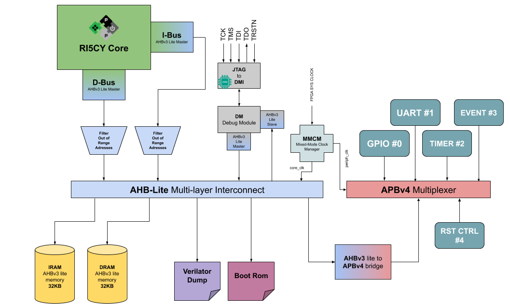

# RISC-V Verilator model

Build a complete SoC using the well-known risc-v [RI5CY](https://github.com/pulp-platform/riscv) CPU from pulp team in verilator or play on real targets such as FPGAs.

## Table of Contents

* [Introduction](#intro)
* [Requirements](#sw_req)
* [SoC architecture](#soc_arch)
* [Structure](#folders)
* [Memory map](#mem_map)
* [How to use](#usage)
    * [Verilator](#verilator)
    * [FPGA](#fpga)
* [Additional makefile rules](#others)
* [FAQ](#faq)
* [Contributions](#imp)
* [License](#lic)

## <a name="intro"></a> Introduction

This repository contains a set of RTLs + C++ files to generate a risc-v simulation model for understanding how the architecture works or to do some testing directly on hardware such as FPGAs. All submodules and RTLs are open-source IPs available at github.com so there's no propertary hardware embedded into and you can easily read/modify as your needs. In resume, with this repo you can:

* Test a simple RISC-V SoC through verilator
    * Enable VCD dump of the traces
    * Enable JTAG localhost through remote bitbang driver
    * Load .elf files directly on the SoC
    * Customize xRAMs size up to 1MB
* Run FPGA synthesis for different targets (*needs vivado for xilinx parts*)
    * Access JTAG interface for loading/debugging programs through FPGA pins
    * Generate programable bitstream for:
        * xc7a35ticsg324-1L - [Arty A7-35T](https://store.digilentinc.com/arty-a7-artix-7-fpga-development-board-for-makers-and-hobbyists/)
        * xc7a100tcsg324-1 - [Arty A7-100T](https://store.digilentinc.com/arty-a7-artix-7-fpga-development-board-for-makers-and-hobbyists/)
        * xc7z020clg400-1 - [PYNQ-Z1](https://store.digilentinc.com/pynq-z1-python-productivity-for-zynq-7000-arm-fpga-soc/)

## <a name="sw_req"></a> Software requirements

The list of softwares needed to run the SoC depends upon your flow:

* Common for both flows:
    * make
    * [riscv toolchain](https://xpack.github.io/riscv-none-embed-gcc/) or any other 32-bit + newlib compatible version
    * [vs code](https://code.visualstudio.com/) - if you want to launch gdb through UI
* For **FPGA** flow you'll need:
    * vivado 2018.1 or higher
    * install digilent vivado boards following [this link](https://reference.digilentinc.com/vivado/installing-vivado/start)
* For **verilator**:
    * g++ 8.x
    * gtkwave
    * verilator 4.018
    
## <a name="soc_arch"></a> SoC architecture

The hardware architecture of this SoC follows the below diagram, with a minor change of including the mmcm (clock divider) just in the FPGA scenario (core clk speed != peripheral speed) or not including
 boot rom in the verilator case. Also, the uart module used in the verilator model is different because verilator does not support VHDL language. The hardware differences can be seen directly on the top file(tb/wrappers/riscv_soc.sv). Once you start the FPGA synthesis the makefiles will add [one more sys. verilog file to the synthesis process, so if you want to connect different wires on fpga top, please refer to [this](tb/wrappers/fpga_wrapper/fpga_wrapper.sv) file.



## <a name="folders"></a> Folders structure

Following a simple structure, each folder has a specific purpose which can be listed here:
```bash
├── doc                     
├── fpga                        
│   ├── constraints             #---> Refers to different synth. constraints of different parts 
│   ├── ips                     #---> tcl script to build FPGA IPs needed on Xilinx
│   └── main                    #---> All tcl scripts to run FPGA flow
├── ips                         #---> Contains all the IPs used of the project
│   ├── ahb3lite_apb_bridge     #---> Bridge for AHB to APB interconnect
│   ├── ahb3lite_interconnect   #---> AHB interconnect itself
│   ├── ahb3lite_memory         #---> AHB generic memory
│   ├── ahb3lite_pkg            #---> AHB package signals (needed by others)
│   ├── apb4_mux                #---> APB mux used as "interconnect like" for peripherals
│   ├── apb_event_unit          #---> APB unit to handle interrupts in the code
│   ├── apb_gpio                #---> APB gpio peripheral
│   ├── apb_uart                #---> APB UART in VHDL (used only in FPGA cause it supports IRQs)
│   ├── apb_uart_sv             #---> APB UART in sys. verilog for verilator usage
│   ├── common_cells            #---> Used by risc-v core 
│   ├── fpnew                   #---> FPU unit if enabled FPU == 1 by RI5CY core
│   ├── memory                  #---> Generic memory models used by AHB memory
│   ├── riscv                   #---> RI5CY core developed by pulp team
│   ├── riscv-dbg               #---> RI5CY Debug module developed by pulp team
│   └── utils                   #---> RTLs added to fillup the design parts
├── sw                         
│   ├── boot_rom                #---> Sources for the FPGA boot rom used
│   ├── common                  #---> Contains the API used by peripherals + some inc. headers
│   └── hello_world             #---> Simple hello world test program for both verilator/FPGA flow
└── tb                          
    ├── cpp                     #---> Contains all cpp sources for verilator testbenches
    ├── debug                   #---> Openocd files to enable debugging through JTAG interface
    ├── inc                     #---> Main headers for setting up the SoC
    ├── waveform_template       #---> Waveform template viewers for gtk wave
    └── wrappers                #---> Contains wrapper for FPGA scenario, SoC top and RI5CY cpu
```

Inside the ips/utils folder there's also an [APB timer peripheral](ips/utils/apb_timer) slightly modified from the owners (from pulp team) to avoid conflicts with verilator once some verilog macros conflict having dupplicated declaration of same name. Other important aspect to consider is the module [filter_oor.sv](ips/utils/filter_oor.sv) rtl that filters the out of range memory mapped slaves inside the AHB bus, once the AHB interconnect IP doesn't have any mechanism to reply on such scenarios causing the CPU requisition hanging eternally waiting for non-existent AHB slave. The filter replies asserting an error output once it detects such cases, in the future this will be connected to the APB event unit (handles IRQ) to detect when it happens so the core could treat with no problems. The converters designed for translating RI5CY CPU memory protocol to AHB Master commands and the opposite (debug ahb slave interface) are quite simple, so it does not cover the full AHB standard with no-burst support neither other split requests, keep this in mind if you're willing to do advanced transactions that need such features.

## <a name="mem_map"></a> Memory map

Here below we have the memory map for the sample SoC considering the AHB and APB interconnect.

|   Description   | Start Address |  End Adress | Size | Slave ID |
|:---------------:|:-------------:|:-----------:|:----:|:--------:|
|       ROM       |  0x1A00_0000  | 0x1A00_FFFF | 64KB |  0 (AHB) |
|   Debug Module  |  0x1B00_0000  | 0x1B00_FFFF | 64KB |  1 (AHB) |
|  Verilator Dump |  0x1C00_0000  | 0x1C00_FFFF | 64KB |  2 (AHB) |
|       IRAM      |  0x2000_0000  | 0x200F_FFFF |  1MB |  3 (AHB) |
|       DRAM      |  0x3000_0000  | 0x300F_FFFF |  1MB |  4 (AHB) |
|  AHB_APB Bridge |  0x4000_0000  | 0x400F_FFFF |  1MB |  5 (AHB) |
|       GPIO      |  0x4000_0000  | 0x4000_FFFF | 64KB |  0 (APB) |
|       UART      |  0x4001_0000  | 0x4001_FFFF | 64KB |  1 (APB) |
|      Timer      |  0x4002_0000  | 0x4002_FFFF | 64KB |  2 (APB) |
| Int. Controller |  0x4003_0000  | 0x4003_FFFF | 64KB |  3 (APB) |
|    Reset Ctrl   |  0x4004_0000  | 0x4004_FFFF | 64KB |  4 (APB) |

## <a name="usage"></a> Usage flow

There're basically two flow options to use this repository, one is to run the soc in your host machine (verilator approach) and the another is to build a FPGA image where you could test RISC-V CPU running on the target and transfer/debug programs through JTAG interface easily. Both flows depends on different tools, check the [software requisites](#sw_req) to understand which tools you would need to install for each of them. 

### <a name="verilator"></a> **1) Verilator**: Running the SoC as host executable program

In this case you'll need verilator tool to compile all the rtls into cpp files that'll generate an executable program. Through this flow you'll be able to use JTAG with remote bitbang (it's slow but it works) or you can directly pass an riscv elf file to the program so the loader will do the procedure of loading the correspondent program headers to the memories. Once both flow use the same Makefile, there're specific rules for different flow, and they are defined as:

#### Makefile rules

* **all/clean** - build/clean verilator rule
* **verilator** - will generate the executable host machine program of the SoC
* **run** - compiles the *hello world* example and calls the SoC program with the correspondent .elf file
* **wave** - open a gtkwave window with the vcd generated after running the SoC on the host machin (executable program should be compiled with EN_VCD=1 variable set)
* **sw** - compile the *hello world* example with VERILAT=1 variable set to verilator usage
* **openocd** - start openocd to connect to localhost using rbb driver set
* **gdb** - start gdb connecting to the target and loading the program

If you're using vs code, this repository also includes a *launch.json* file that'll enable you to use graphical debugging mechanism from vs code, making it easily to put breakpoints and watchers as much as you want. Please mind that localhost debugging + rbb it's slow compared to normal fpga emulation, so it's not recommended compared with FPGA flow. In the makefile there's also some other variables that can be set or not according to your needs and they enable different set of features once you build the **verilator** rule:

#### Makefile specific variables

* **EN_VCD** - Enables VCD dump of the traces of your simulation (default == 0), **WARN:** VCD files can have large size usually with just a few seconds of running, also once you enable vcd dump, the simulation will run a bit slow than compared to non-vcd enabled
* **WAVEFORM_VCD** - Define the default path + name of the VCD waveform dump file (default == /tmp/riscv_soc.vcd)
* **JTAG_BOOT** - Enables the JTAG RBB protocol to interface with the cpp host program, in this case we do not need to pass .elf file to the program (default == 0)
* **JTAG_PORT** - Defines the default TCP port that'll be used to exchange data with openocd through rbb (default == 8080)
* **MAX_THREAD** - Defines the number of maximum threads that'll be used for running the emulation (default == max. of the system)
* **RISCV_TOOLCHAIN** - Defines the default toolchain prefix for building risc-v programs (default == riscv-none-embed)

#### Example of using SoC host program:

```bash
make EN_VCD=1 all WAVEFORM_VCD=output_verilator/dumpfile.vcd #Will generate a riscv_soc executable with vcd dump enabled
./output_verilator/riscv_soc sw/hello_world/output/hello_world.elf  # Run the emulation with hello world program
# After closing the emulation
make wave WAVEFORM_VCD=output_verilator/dumpfile.vcd # will open gtkwave with the waveforms of your emulation
```

It's important to notice that the hello world example project fits for both Verilator/FPGA flow, so because of this we need to use a preprocessor macro to set when we're working with verilator or not, this variable is called **VERILAT** and once it's equal "1", it will make the newlib call *_write* (i.e used in printf) to use the **verilator dump** peripheral instead of UART as in the FPGA case. Writing to this peripheral will make it echo on our terminal easily, so we could see it and log it latter on running in the host machine.

### <a name="fpga"></a> **2) FPGA**: Synthetizing SoC for FPGA

In this case to build an image for FPGA, the repository contains a set of scripts in tcl that'll build the hardware for Xilinx parts. Through this option it's recommended to use digilent boards, such as the ones described in the [introduction](#intro) because the *xilinx design constraints* files are written to be compatible with these boards, you could also use different parts but for such cases you'll need to write another option for the variable FPGA_BOARD.

#### Makefile rules

* **fpga** - will build a bitstream using the [fpga_wrapper](tb/wrappers/fpga_wrapper/fpga_wrapper.sv) top module
* **clean_fpga** - will clean all output files from FPGA build
* **mcs** - should be run after bitstream generation to generate SPI flash cfg file
* **program_mcs** - will try to program the fpga with the mcs file
* **openocd_fpga** - it starts the openocd to connect with the FPGA, there're two cfg files available to use (check at tb/debug/), the makefile will use riscv_pulp_fpga.cfg + debug adapter specific cfg

If you're using vs code, this repository also includes a *launch.json* file that'll enable you to use graphical debugging mechanism from vs code, making it easily to put breakpoints and watchers as much as you want. To connect with the FPGA, you need to run first the openocd_fpga rule and then select on debug mode of vs-code the "RISC-V launch" option, then gdb will be started debugging the hello_world example.

#### Makefile specific variables

* **FPGA_BOARD** - Select what digilent fpga board you're working with between the three options available = artix_a35/artix_a100/pynq (default == artix_a35)
* **SYNTH_MODE** - Define the synthesis mode between none, fukk, rebuilt (check [this link](https://www.xilinx.com/support/documentation/sw_manuals/xilinx2018_3/ug901-vivado-synthesis.pdf) page 11 to understand) (default == none)
* **FPGA_WRAPPER** - Select the FPGA wrapper used in the build (default === artix_wrapper)
* **CPU_CORES** - Define number of CPUs to run fpga synthesis (default === 8)

#### Example of using SoC on the FPGA:

```bash
make fpga FPGA_BOARD=artix_a35  #Will generate the bitstream for the xilinx part artix a35
make mcs FPGA_BOARD=artix_a35  #Will generate the mcs file
make program_mcs FPGA_BOARD=artix_a35  #Will program the fpga board with the mcs file
make openocd_fpga #Will run openocd and connect to the fpga, then wait for gdb client
#open another terminal, press PROG button on fpga board
make -C TEST_PROG=hello_world clean #Avoid old build with VERILAT already set to 1
make gdb TEST_PROG=hello_world VERILAT=0 #Will build the program without setting verilator dump as stdout and then will connect+load the elf program, then run
```

By default this example will build the hello_world project and then echo on UART the printf statements inside the example. In the FPGA it's strongly recommended run "make openocd_fpga" and use vs-code for debugging once you have easy start/stop/stepp/steppi resources under the editor, what you do not have running gdb through cli mode so easy with "make gdb...".

### Makefile variables common for both

* **IRAM_KB_SIZE** - Defines the size in kilobytes of the instruction RAM memory (default == 32KB)
* **DRAM_KB_SIZE** - Defines the size in kilobytes of the data RAM memory (default == 32KB)
* **RISCV_TOOLCHAIN** - Defines the default toolchain prefix for building risc-v programs (default == riscv-none-embed)
* **TEST_PROG** - Defines the project inside sw/ folder to run compilation and start gdb
* **VERILAT** - Set the projects under sw/ folder to be compiled to verilator or FPGA (default == 1, i.e verilator) 

## <a name="others"></a> Other makefile rules

There are other rules that do basic stuff and might be useful or not accordingo the needs of users. Listed below we have:

* **check** - Simple check to see if you have sw pre-requisites for using verilator
* **install** - Install such requisites through apt package manager
* **docker** - Will run dockerfile to build a docker image with the emulator on host (debian:bullseye) with JTAG enabled
* **rundocker** - Will use docker-compose.yaml to download and run a cloud image of emulator with JTAG enable and set to port 8080/tcp

## <a name="faq"></a> FAQ

### *1) When I open your files everything seems bad formatted...*

**answer**: please use this repository with vs code + **editor config** plugin enabled, so then it'll open correctly and well formatted

### *2) I want to port to the digilent based Xilinx FPGA XXXX...*

**answer**: to add a different XILINX part, you need to create another folder inside **fpga/constraints/YOUR-NEW-XILINX-PART** and the PN should match with the ones available at "YOUR-INSTALL-DIR/Xilinx/Vivado/2018.1/data/boards/board_parts", the board_parts folder existe if you installed the digilent vivado boards as mentioned in [beginning](#sw_req). Inside this folder you can put many different *.xdc* files that must match with the [top fpga file](tb/wrappers/fpga_wrapper/fpga_wrapper.sv) pins. Then edit the main [Makefile](Makefile) adding a new option to the if/else structure inside following the template:
```bash
...
else ifeq ($(FPGA_BOARD),YOUR-BOARD-NAME)
	XILINX_BOARD	:=	YOUR-XILINX-BOARD-CODE
	XILINX_PART		:=	YOUR-NEW-XILINX-PART
	XILINX_TARGET	:=	YOUR-XILINX-TARGET-CODE
	HW_PART			:=	YOUR-XILINX-HWPART-CODE
	MEM_PART		:=	YOUR-XILINX-MEM-MCS-CODE
...
```

### *3) I want to port to custom Xilinx FPGA XXXX...*

**answer**: Follow the same approach in 2) but do not consider filling the HW_PART/MEM_PART variables once you probably does not have a compatible memory. For the other variables, you can copy/paste following the digilent templates to create a custom XILINX_BOARD definition.

### *4) I didn't understand what's the JTAG through RBB?*

**answer**: Please take a look at [this link](https://github.com/chipsalliance/rocket-chip#2-compiling-and-executing-a-custom-program-using-the-emulator) that I use the same approach as rocket-chip does.

### *5) I want to debug a different program...*

**answer**: As simple as copying the hello_world project under the same directory and customizing the local makefile inside sw/YOUR-FANCY-PRJ/Makefile. Then later on set **TST_PROG**=YOUR-FANCY-PRJ to compile and run it properly following the available flow.

### *6) I want to add more IPs in the fpga/verilator run...*

**answer**: Add those files under ips folder and add the folder name into **SOC_IPS** [Makefile](Makefile) variable, the Makefile script will try to get all sys/verilog/vhdl files from your new ip folder. If you don't want to let the Makefile to do this, just specify the files one by one appending the list in the same variable. VHDL files will be included just in the FPGA flow, not in the verilator case. If your files need to include some headers or others, append such folder under the variable **INC_VERILOG**. If your files need to set some macros, append them in the variable **MACRO_VLOG**. Check the [makefile](Makefile) to see how it works.

### *7) I want to add more cpp files over my verilator testbench...*

**answer**: Add those files in the same directory as the [testbench](tb/cpp) and if you need to include headers, append to the Makefile variable **INC_CPP** such as been done by elfio submodule. Check the [makefile](Makefile) to see how it works.

### *8) I want to customize the SoC/RI5CY core...*

**answer**: Please take a look into [ri5cy configuration file](tb/inc/config_ri5cy.v) and/or [SoC configuration file](tb/inc/config_soc.v). Keep in mind that you should understand what you're editting once it can lead to make the SoC not work if you change variables like DM_HaltAddress in the ri5cy cpu or they it calculates ahb memories inside SoC cfg.

## <a name="imp"></a> Want to improve?

Want to improve adding new set of fpga building scripts or fixing some bugs found? Please consider making a pull request with the commits squashed and explain what you have done.

## <a name="lic"></a> License

Project released under Apache 2.0 license, check it over [license file](LICENSE.txt).
