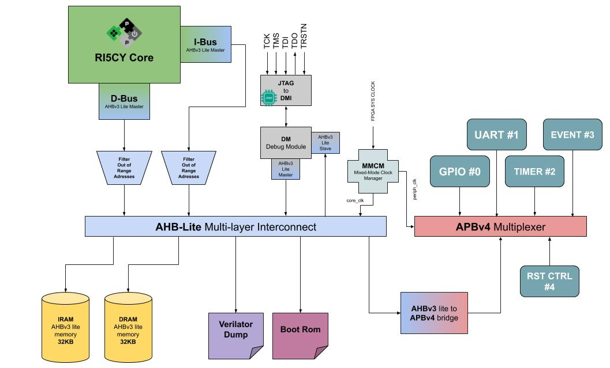

# RISC-V Verilator model

## Table of Contents

+ [Quick instructions](#quick)

## <a name="soc_arch"></a> Introduction

This repository contains a set of RTLs + C++ files to generate a risc-v simulation model for understanding how the architecture works or to do some testing directly on hardware such as FPGAs. All submodules and RTLs are open-source IPs available at github.com so there's no propertary hardware embedded into and you can easily read/modify as your needs. In resume, with this repo you can:

* Test a simple RISC-V SoC through verilator
    * Enable VCD dump of the traces
    * Enable JTAG localhost through remote bitbang driver
    * Load .elf files directly on the SoC
    * Customize xRAMs size up to 1MB
* Run FPGA synthesis for different targets (*needs vivado for xilinx parts*)
    * Access JTAG interface for loading/debugging programs through FPGA pins
    * Generate programable bitstream for:
        * xc7a35ticsg324-1L - [Arty A7-35T](https://store.digilentinc.com/arty-a7-artix-7-fpga-development-board-for-makers-and-hobbyists/)
        * xc7a100tcsg324-1 - [Arty A7-100T](https://store.digilentinc.com/arty-a7-artix-7-fpga-development-board-for-makers-and-hobbyists/)
        * xc7z020clg400-1 - [PYNQ-Z1](https://store.digilentinc.com/pynq-z1-python-productivity-for-zynq-7000-arm-fpga-soc/)

## <a name="sw_req"></a> Software requirements

The list of softwares needed to run the SoC depends upon your flow:

* Common for both flows:
    * make
    * [riscv toolchain](https://xpack.github.io/riscv-none-embed-gcc/) or any other 32-bit + newlib compatible version
    * [vs code](https://code.visualstudio.com/) - if you want to launch gdb through UI
* For **FPGA** flow you'll need:
    * vivado 2018.1 or higher
* For **verilator**:
    * g++ 8.x
    * gtkwave
    * verilator 4.018
    
## <a name="soc_arch"></a> SoC architecture

The hardware architecture of this SoC follows the below diagram, with a minor change of including the mmcm (clock divider) just in the FPGA scenario (core clk speed != peripheral speed) or not including
 boot rom in the verilator case. Also, the uart module used in the verilator model is different because verilator does not support VHDL language. The hardware differences can be seen directly on the top file(tb/wrappers/riscv_soc.sv). Once you start the FPGA synthesis the makefiles will add [one more sys. verilog file to the synthesis process, so if you want to connect different wires on fpga top, please refer to [this](tb/wrappers/fpga_wrapper/fpga_wrapper.sv) file.



## <a name="folders"></a> Folders structure

Following a simple structure, each folder has a specific purpose which can be listed here:
```bash
├── doc                     
├── fpga                        
│   ├── constraints             #---> Refers to different synth. constraints of different parts 
│   ├── ips                     #---> tcl script to build FPGA IPs needed on Xilinx
│   └── main                    #---> All tcl scripts to run FPGA flow
├── ips                         #---> Contains all the IPs used of the project
│   ├── ahb3lite_apb_bridge     #---> Bridge for AHB to APB interconnect
│   ├── ahb3lite_interconnect   #---> AHB interconnect itself
│   ├── ahb3lite_memory         #---> AHB generic memory
│   ├── ahb3lite_pkg            #---> AHB package signals (needed by others)
│   ├── apb4_mux                #---> APB mux used as "interconnect like" for peripherals
│   ├── apb_event_unit          #---> APB unit to handle interrupts in the code
│   ├── apb_gpio                #---> APB gpio peripheral
│   ├── apb_uart                #---> APB UART in VHDL (used only in FPGA cause it supports IRQs)
│   ├── apb_uart_sv             #---> APB UART in sys. verilog for verilator usage
│   ├── common_cells            #---> Used by risc-v core 
│   ├── fpnew                   #---> FPU unit if enabled FPU == 1 by RI5CY core
│   ├── memory                  #---> Generic memory models used by AHB memory
│   ├── riscv                   #---> RI5CY core developed by pulp team
│   ├── riscv-dbg               #---> RI5CY Debug module developed by pulp team
│   └── utils                   #---> RTLs added to fillup the design parts
├── sw                         
│   ├── boot_rom                #---> Sources for the FPGA boot rom used
│   ├── common                  #---> Contains the API used by peripherals + some inc. headers
│   └── hello_world             #---> Simple hello world test program for both verilator/FPGA flow
└── tb                          
    ├── cpp                     #---> Contains all cpp sources for verilator testbenches
    ├── debug                   #---> Openocd files to enable debugging through JTAG interface
    ├── inc                     #---> Main headers for setting up the SoC
    ├── waveform_template       #---> Waveform template viewers for gtk wave
    └── wrappers                #---> Contains wrapper for FPGA scenario, SoC top and RI5CY cpu
```

Inside the ips/utils folder there's also an [APB timer peripheral](ips/utils/apb_timer) slightly modified from the owners (from pulp team) to avoid conflicts with verilator once some verilog macros conflict having dupplicated declaration of same name. Other important aspect to consider is the module [filter_oor.sv](ips/utils/filter_oor.sv) rtl that filters the out of range memory mapped slaves inside the AHB bus, once the AHB interconnect IP doesn't have any mechanism to reply on such scenarios causing the CPU requisition hanging eternally waiting for non-existent AHB slave. The filter replies asserting an error output once it detects such cases, in the future this will be connected to the APB event unit (handles IRQ) to detect when it happens so the core could treat with no problems. The converters designed for translating RI5CY CPU memory protocol to AHB Master commands and the opposite (debug ahb slave interface) are quite simple, so it does not cover the full AHB standard with no-burst support neither other split requests, keep this in mind if you're willing to do advanced transactions that need such features.

## <a name="usage"></a> Usage flow

There're basically two flow options to use this repository, one is to run the soc in your host machine (verilator approach) and the another is to build a FPGA image where you could test RISC-V CPU running on the target and transfer/debug programs through JTAG interface easily. Both flows depends on different tools, check the [software requisites](#sw_req) to understand which tools you would need to install for each of them. 

### **1) Verilator**: Running the SoC as host executable program

In this case you'll need verilator tool to compile all the rtls into cpp files that'll generate an executable program. Through this flow you'll be able to use JTAG with remote bitbang (it's slow but it works) or you can directly pass an riscv elf file to the program so the loader will do the procedure of loading the correspondent program headers to the memories. Once both flow use the same Makefile, there're specific rules for different flow, and they are defined as:

#### Makefile rules

* **all/clean** - build/clean verilator rule
* **verilator** - will generate the executable host machine program of the SoC
* **run** - compiles the *hello world* example and calls the SoC program with the correspondent .elf file
* **wave** - open a gtkwave window with the vcd generated after running the SoC on the host machin (executable program should be compiled with EN_VCD=1 variable set)
* **sw** - compile the *hello world* example with VERILAT=1 variable set to verilator usage
* **openocd** - start openocd to connect to localhost using rbb driver set
* **gdb** - start gdb connecting to the target and loading the program

If you're using vs code, this repository also includes a *launch.json* file that'll enable you to use graphical debugging mechanism from vs code, making it easily to put breakpoints and watchers as much as you want. Please mind that localhost debugging + rbb it's slow compared to normal fpga emulation, so it's not recommended compared with FPGA flow. In the makefile there's also some other variables that can be set or not according to your needs and they enable different set of features once you build the **verilator** rule:

#### Makefile variables

* **EN_VCD** - Enables VCD dump of the traces of your simulation (default == 0), **WARN:** VCD files can have large size usually with just a few seconds of running, also once you enable vcd dump, the simulation will run a bit slow than compared to non-vcd enabled
* **WAVEFORM_VCD** - Define the default path + name of the VCD waveform dump file (default == /tmp/riscv_soc.vcd)
* **JTAG_BOOT** - Enables the JTAG RBB protocol to interface with the cpp host program, in this case we do not need to pass .elf file to the program (default == 0)
* **JTAG_PORT** - Defines the default TCP port that'll be used to exchange data with openocd through rbb (default == 8080)
* **MAX_THREAD** - Defines the number of maximum threads that'll be used for running the emulation (default == max. of the system)
* **RISCV_TOOLCHAIN** - Defines the default toolchain prefix for building risc-v programs (default == riscv-none-embed)

#### Example of using SoC host program:

```bash
make EN_VCD=1 all WAVEFORM_VCD=output_verilator/dumpfile.vcd #Will generate a riscv_soc executable with vcd dump enabled
./output_verilator/riscv_soc sw/hello_world/output/hello_world.elf  # Run the emulation with hello world program
# After closing the emulation
make wave # will open gtkwave with the waveforms of your emulation
```

It's important to notice that the hello world example project fits for both Verilator/FPGA flow, so because of this we need to use a preprocessor macro to set when we're working with verilator or not, this variable is called **VERILAT** and once it's equal "1", it will make the newlib call *_write* (i.e used in printf) to use the **verilator dump** peripheral instead of UART as in the FPGA case. Writing to this peripheral will make it echo on our terminal easily, so we could see it and log it latter on running in the host machine.

### **2) FPGA**: Synthetizing SoC for FPGA

In this case you'll 

#### Makefile rules

* **fpga** - build/clean verilator rule
* **clean_fpga** - will generate the executable host machine program of the SoC
* **mcs** - compiles the *hello world* example and calls the SoC program with the correspondent .elf file
* **program_mcs** - open a gtkwave window with the vcd generated after running the SoC on the host machin (executable program should be compiled with EN_VCD=1 variable set)
* **openocd_fpga** - compile the *hello world* example with VERILAT=1 variable set to verilator usage

If you're using vs code, this repository also includes a *launch.json* file that'll enable you to use graphical debugging mechanism from vs code, making it easily to put breakpoints and watchers as much as you want. Please mind that localhost debugging + rbb it's slow compared to normal fpga emulation, so it's not recommended compared with FPGA flow. In the makefile there's also some other variables that can be set or not according to your needs and they enable different set of features once you build the **verilator** rule:

#### Makefile variables

* **EN_VCD** - Enables VCD dump of the traces of your simulation (default == 0), **WARN:** VCD files can have large size usually with just a few seconds of running, also once you enable vcd dump, the simulation will run a bit slow than compared to non-vcd enabled
* **WAVEFORM_VCD** - Define the default path + name of the VCD waveform dump file (default == /tmp/riscv_soc.vcd)
* **JTAG_BOOT** - Enables the JTAG RBB protocol to interface with the cpp host program, in this case we do not need to pass .elf file to the program (default == 0)
* **JTAG_PORT** - Defines the default TCP port that'll be used to exchange data with openocd through rbb (default == 8080)
* **MAX_THREAD** - Defines the number of maximum threads that'll be used for running the emulation (default == max. of the system)
* **RISCV_TOOLCHAIN** - Defines the default toolchain prefix for building risc-v programs (default == riscv-none-embed)

#### Makefile variables common for flow 1) and 2)

* **IRAM_KB_SIZE** - Defines the number of maximum threads that'll be used for running the emulation (default == max. of the system)
* **DRAM_KB_SIZE** - Defines the number of maximum threads that'll be used for running the emulation (default == max. of the system)


## <a name="faq"></a> FAQ

### *When I open your files everything seems bad formatted...*

**answer**: please use this repository with vs code + **editor config** plugin enabled, so then it'll open correctly and well formatted

### *I want to port to the Xilinx FPGA xxxxxx, how can I do it?...*

### *I didn't understand what's the JTAG through RBB? wtf!?*

https://github.com/chipsalliance/rocket-chip#2-compiling-and-executing-a-custom-program-using-the-emulator


|   Description   | Start Address |  End Adress | Size | Slave ID |
|:---------------:|:-------------:|:-----------:|:----:|:--------:|
|       ROM       |  0x1A00_0000  | 0x1A00_FFFF | 64KB |  0 (AHB) |
|   Debug Module  |  0x1B00_0000  | 0x1B00_FFFF | 64KB |  1 (AHB) |
|  Verilator Dump |  0x1C00_0000  | 0x1C00_FFFF | 64KB |  2 (AHB) |
|       IRAM      |  0x2000_0000  | 0x200F_FFFF |  1MB |  3 (AHB) |
|       DRAM      |  0x3000_0000  | 0x300F_FFFF |  1MB |  4 (AHB) |
|  AHB_APB Bridge |  0x4000_0000  | 0x400F_FFFF |  1MB |  5 (AHB) |
|       GPIO      |  0x4000_0000  | 0x4000_FFFF | 64KB |  0 (APB) |
|       UART      |  0x4001_0000  | 0x4001_FFFF | 64KB |  1 (APB) |
|      Timer      |  0x4002_0000  | 0x4002_FFFF | 64KB |  2 (APB) |
| Int. Controller |  0x4003_0000  | 0x4003_FFFF | 64KB |  3 (APB) |
|    Reset Ctrl   |  0x4004_0000  | 0x4004_FFFF | 64KB |  4 (APB) |
